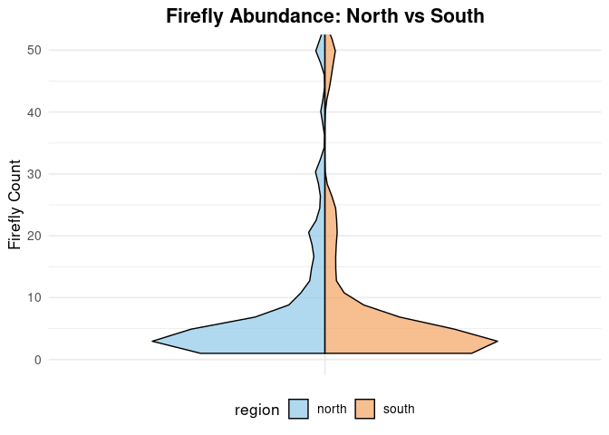

Fireflies North vs South
================
Caden Blaser
2025-11-11

- [ABSTRACT](#abstract)
- [BACKGROUND](#background)
- [STUDY QUESTION and HYPOTHESIS](#study-question-and-hypothesis)
  - [Questions](#questions)
  - [Hypothesis](#hypothesis)
  - [Prediction](#prediction)
- [METHODS](#methods)
- [Plot 1](#plot-1)
- [DISCUSSION](#discussion)
  - [Interpretation of 1st analysis](#interpretation-of-1st-analysis)
  - [Interpretation of 2nd analysis](#interpretation-of-2nd-analysis)
- [CONCLUSION](#conclusion)
- [REFERENCES](#references)

# ABSTRACT

Fill in abstract at the end after we have finished the methods, results,
discussion, conclusions and know what our data “says”.

# BACKGROUND

Fireflies are bioliminescent beetles that are commonly observed in
temperate and tropical regions. The abundance and activity of fireflies
are influenced by environmental conditions like temperature, humidity,
soil moisture, and the availability of light. Since the larval and adult
stages are both sensitive to climate changes, firefly populations will
vary across geographic gradients. Specifically, regional differences in
precipitation and temperature can strongly influence the fireflies
breeding success as well as the adult emergence rates (Lewis, 2016).

Geographic location plays a big role in determining the firefly
abundance. The northern regions typically experience cooler temperatures
and a higher amount of moisture, which promotes a higher larval suvival
and an increase in the overall abundance. On the other hand, southern
areas typically experience higher temperature and more drier conditions
that lead to a reduction in firefly activity.

To be able to explore these kinds of patterns, our study asks: Does the
abundance of fireflies vary between northern and southern regions in
Utah. We hypothesize that northern populations will have a higher
abundance than southern populations because of the cooler temperatures
and an increase in moisture levels which promotes larval survival and
overall firefly activity (Lewis, 2016). Based off of this hypothesis, we
predicted that the northern regions of Utah will show a higher mean
abundance of fireflies compared to the southern regions, which we will
be able to visualize using a bar graph, violin plot, and a test
statistic by using a poisson test.

# STUDY QUESTION and HYPOTHESIS

## Questions

Does the location (Northern or Southern) of the fireflies affect the
level of abundance.

## Hypothesis

The geographic location of fireflies (Northern vs. Southern populations)
will affect the abundance, with northern populations having a higher
abundance than southern populations due to the climate.

## Prediction

If we find that geographic location affects firefly abundance, then
northern populations will have a higher abundance of fireflies that
southern populations.

# METHODS

Observational data was collected to estimate firefly counts in northern
and southern regions of Utah. Each record included the number of
fireflies observed and the corresponding geographic location. Our
dataset was then polished by getting rid of incomplete recors, and
observations that were grouped by region for analysis. To be able to
visualize the difference, a bar graph was used to show the mean
abundance with standard deviation, and a violin plot was used to show
the distribution of counts in each region. Then a poisson test was
conducted to determine if the mean firefly abundance differed between
northern and southern populations, with a significant p-value of 0.003.

# Plot 1

``` r
# Firefly Boxplot (Log-Transformed, No Blanks)

library(ggplot2)

# Read in the data
fireflies <- read.csv("Copy of firefliesUtah - Usable Data.csv", stringsAsFactors = FALSE)
colnames(fireflies) <- c("firefly_count", "region")

# Remove blank or missing region values
fireflies <- subset(fireflies, region != "" & !is.na(region))

# Box plot with log10 transformation (+1 to avoid log(0))
ggplot(fireflies, aes(x = region, y = log10(firefly_count + 1), fill = region)) +
geom_boxplot(width = 0.6, color = "black", alpha = 0.7) +
labs(
title = "Firefly Abundance by Region (Log Scale)",
x = "Region",
y = "Log-Transformed Firefly Count"
) +
scale_fill_manual(values = c("north" = "#8EC9E8", "south" = "#F4A261")) +
theme_minimal(base_size = 13) +
theme(
legend.position = "none",
plot.title = element_text(size = 16, face = "bold", hjust = 0.5),
axis.text = element_text(size = 12),
axis.title = element_text(size = 13),
panel.grid.major.x = element_blank(),
panel.grid.minor = element_blank()
)
```

    ## Warning: Removed 1 row containing non-finite outside the scale range
    ## (`stat_boxplot()`).

<!-- --> \# 1st
Analysis

``` r
# Split Violin Plot (y-axis limited to 50)

library(ggplot2)
library(gghalves)
library(stringi)

# Read and clean your data
fireflies <- read.csv("Copy of firefliesUtah - Usable Data.csv", stringsAsFactors = FALSE)
colnames(fireflies) <- c("firefly_count", "region")

fireflies$region[fireflies$region == ""] <- NA
fireflies$region <- stri_trans_general(fireflies$region, "NFKC")
fireflies$region <- stri_replace_all_regex(fireflies$region, "\\p{C}", "")
fireflies$region <- gsub("\u00A0", " ", fireflies$region)
fireflies$region <- trimws(tolower(fireflies$region))
fireflies$region[fireflies$region %in% c("n", "nrth", "noth")] <- "north"
fireflies$region[fireflies$region %in% c("s", "sth", "soth")] <- "south"
fireflies$region <- factor(fireflies$region, levels = c("north", "south"))
fireflies_clean <- droplevels(subset(fireflies, !is.na(region)))

# Split violin plot
ggplot() +
geom_half_violin(
data = subset(fireflies_clean, region == "north"),
aes(x = factor(1), y = firefly_count, fill = region),
side = "l", trim = TRUE, color = "black", alpha = 0.7
) +
geom_half_violin(
data = subset(fireflies_clean, region == "south"),
aes(x = factor(1), y = firefly_count, fill = region),
side = "r", trim = TRUE, color = "black", alpha = 0.7
) +
scale_fill_manual(values = c("north" = "#8EC9E8", "south" = "#F4A261")) +
coord_cartesian(ylim = c(0, 50)) + # y-axis capped at 50
labs(
title = "Firefly Abundance: North vs South",
x = NULL,
y = "Firefly Count"
) +
theme_minimal(base_size = 13) +
theme(
legend.position = "bottom",
plot.title = element_text(size = 16, face = "bold", hjust = 0.5),
axis.text.x = element_blank(),
axis.ticks.x = element_blank()
)
```

    ## Warning: Removed 1 row containing non-finite outside the scale range
    ## (`stat_half_ydensity()`).

<!-- --> \# 2nd
Analysis

``` r
# Read in the data
fireflies <- read.csv("Copy of firefliesUtah - Usable Data.csv", stringsAsFactors = FALSE)
colnames(fireflies) <- c("firefly_count", "region")

# Remove blank or missing region values
fireflies <- subset(fireflies, region != "" & !is.na(region))

# Poisson regression
poisson_model <- glm(firefly_count ~ region, data = fireflies, family = "poisson")

# Summary of the model
summary(poisson_model)
```

    ## 
    ## Call:
    ## glm(formula = firefly_count ~ region, family = "poisson", data = fireflies)
    ## 
    ## Coefficients:
    ##             Estimate Std. Error z value Pr(>|z|)    
    ## (Intercept)  2.62561    0.01293  203.06   <2e-16 ***
    ## regionsouth  1.13788    0.02340   48.63   <2e-16 ***
    ## ---
    ## Signif. codes:  0 '***' 0.001 '**' 0.01 '*' 0.05 '.' 0.1 ' ' 1
    ## 
    ## (Dispersion parameter for poisson family taken to be 1)
    ## 
    ##     Null deviance: 30429  on 493  degrees of freedom
    ## Residual deviance: 28450  on 492  degrees of freedom
    ##   (1 observation deleted due to missingness)
    ## AIC: 30188
    ## 
    ## Number of Fisher Scoring iterations: 7

``` r
# Exponentiated coefficients (rate ratios)
exp(coef(poisson_model))
```

    ## (Intercept) regionsouth 
    ##   13.812933    3.120145

``` r
# Check for overdispersion
dispersion <- sum(residuals(poisson_model, type = "pearson")^2) / poisson_model$df.residual
dispersion # If > 1.5, overdispersion may be present
```

    ## [1] 273.6239

``` r
# Quasi-Poisson if overdispersion
quasi_model <- glm(firefly_count ~ region, data = fireflies, family = "quasipoisson")
summary(quasi_model)
```

    ## 
    ## Call:
    ## glm(formula = firefly_count ~ region, family = "quasipoisson", 
    ##     data = fireflies)
    ## 
    ## Coefficients:
    ##             Estimate Std. Error t value Pr(>|t|)    
    ## (Intercept)   2.6256     0.2139   12.28  < 2e-16 ***
    ## regionsouth   1.1379     0.3871    2.94  0.00344 ** 
    ## ---
    ## Signif. codes:  0 '***' 0.001 '**' 0.01 '*' 0.05 '.' 0.1 ' ' 1
    ## 
    ## (Dispersion parameter for quasipoisson family taken to be 273.6309)
    ## 
    ##     Null deviance: 30429  on 493  degrees of freedom
    ## Residual deviance: 28450  on 492  degrees of freedom
    ##   (1 observation deleted due to missingness)
    ## AIC: NA
    ## 
    ## Number of Fisher Scoring iterations: 7

``` r
# Add predicted counts to the data
fireflies$predicted_count <- predict(poisson_model, newdata = fireflies, type = "response")
```

# DISCUSSION

## Interpretation of 1st analysis

## Interpretation of 2nd analysis

# CONCLUSION

# REFERENCES

1.  ChatGPT. OpenAI, version Jan 2025. Used as a reference for functions
    such as plot() and to correct syntax errors. Accessed 2025-11-11.
    2.Lewis, S. M. (2016). Silent Sparks: The Wondrous World of
    Fireflies. Princeton University Press.
