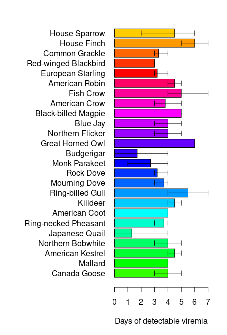
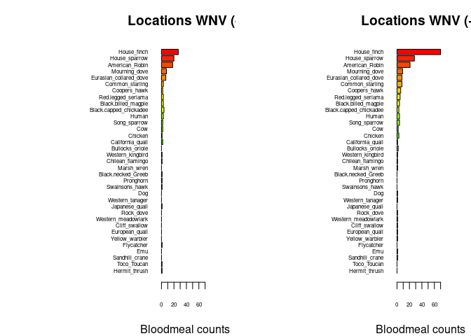

Warm-up mini-Report: Mosquito Blood Hosts in Salt Lake City, Utah
================
Caden Blaser
2025-10-09

- [ABSTRACT](#abstract)
- [STUDY QUESTION and HYPOTHESIS](#study-question-and-hypothesis)
  - [Questions](#questions)
  - [Hypothesis](#hypothesis)
  - [Prediction](#prediction)
  - [Fill in 1st analysis
    e.g. barplots](#fill-in-1st-analysis-eg-barplots)
  - [Fill in 2nd analysis/plot e.g. generalized linear
    model](#fill-in-2nd-analysisplot-eg-generalized-linear-model)
- [DISCUSSION](#discussion)
  - [Interpretation of 1st analysis
    (e.g. barplots)](#interpretation-of-1st-analysis-eg-barplots)
  - [Interpretation of 2nd analysis (e.g. generalized linear
    model)](#interpretation-of-2nd-analysis-eg-generalized-linear-model)
- [CONCLUSION](#conclusion)
- [REFERENCES](#references)

# ABSTRACT

This report investigates which bird species in Salt Lake serves as the
primary amplifying host for West Nile Virus (WNV). Mosquito blood meals
were analyzed in able to determine the host species, and WNV infection
were collected from mosquito pools. Feeding patterns were compared
between all the sites with and without WNV-positive pools using barplots
shown below, and generalized linear models tested whether certain hosts
predicted WNV presence and positivity rates. Both analyses showed that
sites with more House Finch blood meals had a much higher WNV activity.
These results indicate that House Finches are frequently fed upon by
mosquitoes and they act as key amplifying hosts. Overall, the study
highlights the important role of House Finches in sustaining WNV
transmission in this region.

Fill in abstract… Write this last, after finishing methods, results, and
discussion. Summarize the overall study question, approach, results, and
conclusion in a short paragraph. in class \# BACKGROUND

West Nile virus (WNV) is a mosquito-borne virus that is primarily
transmitted by Culex mosquitoes, with birds being the primary hosts.
Understanding which species mosquitoes feed on is crucial because host
choice directly influences virus transmission. Certain birds, such as
house finches, can also develop high levels of viremia. This means that
when mosquitoes feed on these birds, they can easily acquire the virus
and later transmit it to other hosts, playing an important role in the
spread of WNV (Komar et al., 2003).

Modern technologies now allow for a much better identification of
mosquito blood meals. In these methods, DNA is first extracted from
mosquitoes, then amplified using PCR techniques that target
vertebrate-specific markers. The amplified DNA is then sequenced to
determine the host species. This approach provides a precise way to
identify what animals mosquitoes are feeding on. By quantifying feeding
patterns across different locations, researchers can better understand
how mosquito behavior links to WNV transmission, helping to identify
high-risk areas and species that are important for the virus cycle.

``` r
# Manually transcribe duration (mean, lo, hi) from the last table column
duration <- data.frame(
  Bird = c("Canada Goose","Mallard", 
           "American Kestrel","Northern Bobwhite",
           "Japanese Quail","Ring-necked Pheasant",
           "American Coot","Killdeer",
           "Ring-billed Gull","Mourning Dove",
           "Rock Dove","Monk Parakeet",
           "Budgerigar","Great Horned Owl",
           "Northern Flicker","Blue Jay",
           "Black-billed Magpie","American Crow",
           "Fish Crow","American Robin",
           "European Starling","Red-winged Blackbird",
           "Common Grackle","House Finch","House Sparrow"),
  mean = c(4.0,4.0,4.5,4.0,1.3,3.7,4.0,4.5,5.5,3.7,3.2,2.7,1.7,6.0,4.0,
           4.0,5.0,3.8,5.0,4.5,3.2,3.0,3.3,6.0,4.5),
  lo   = c(3,4,4,3,0,3,4,4,4,3,3,1,0,6,3,
           3,5,3,4,4,3,3,3,5,2),
  hi   = c(5,4,5,5,4,4,4,5,7,4,4,4,4,6,5,
           5,5,5,7,5,4,3,4,7,6)
)

# Choose some colors
cols <- c(rainbow(30)[c(10:29,1:5)])  # rainbow colors

# horizontal barplot
par(mar=c(5,12,2,2))  # wider left margin for names
bp <- barplot(duration$mean, horiz=TRUE, names.arg=duration$Bird,
              las=1, col=cols, xlab="Days of detectable viremia", xlim=c(0,7))

# add error bars
arrows(duration$lo, bp, duration$hi, bp,
       angle=90, code=3, length=0.05, col="black", xpd=TRUE)
```



# STUDY QUESTION and HYPOTHESIS

## Questions

Which bird species in Salt Lake City serves as the primary amplifying
host for West Nile Virus (WNV)?

## Hypothesis

Bird species that are fed on more frequently by mosquitoes are more
likely to act as important amplifying hosts of WNV.

## Prediction

If a species turns out to be an effective amplifying host, then the
individuals of that species will show a higher viremia compared to other
species, leading to mosquitoes biting them more often. \# METHODS

Fill in here… Summarize the procedures and analyses you use in this
report. In this section, describe what you did and why. Don’t just
restate the code — explain the logic of each analysis in plain language.
Keep each subsection short (2–4 sentences).

## Fill in 1st analysis e.g. barplots

We compared the number of mosquito blood meals from each of the host
species between sites that had no WNV-positive pools and sites that had
one or more WNV-positive pools. A barplot was used to visualize the data
because it makes it easy to compare feeding patterns across the
different sites. This is able to help us see if mosquitoes feed more on
certain species at sites where WNV is present versus where WNV is
absent.

``` r
## import counts_matrix: data.frame with column 'loc_positives' (0/1) and host columns 'host_*'
counts_matrix <- read.csv("./bloodmeal_plusWNV_for_BIOL3070.csv")

## 1) Identify host columns
host_cols <- grep("^host_", names(counts_matrix), value = TRUE)

if (length(host_cols) == 0) {
  stop("No columns matching '^host_' were found in counts_matrix.")
}

## 2) Ensure loc_positives is present and has both levels 0 and 1 where possible
counts_matrix$loc_positives <- factor(counts_matrix$loc_positives, levels = c(0, 1))

## 3) Aggregate host counts by loc_positives
agg <- stats::aggregate(
  counts_matrix[, host_cols, drop = FALSE],
  by = list(loc_positives = counts_matrix$loc_positives),
  FUN = function(x) sum(as.numeric(x), na.rm = TRUE)
)

## make sure both rows exist; if one is missing, add a zero row
need_levels <- setdiff(levels(counts_matrix$loc_positives), as.character(agg$loc_positives))
if (length(need_levels)) {
  zero_row <- as.list(rep(0, length(host_cols)))
  names(zero_row) <- host_cols
  for (lv in need_levels) {
    agg <- rbind(agg, c(lv, zero_row))
  }
  ## restore proper type
  agg$loc_positives <- factor(agg$loc_positives, levels = c("0","1"))
  ## coerce numeric host cols (they may have become character after rbind)
  for (hc in host_cols) agg[[hc]] <- as.numeric(agg[[hc]])
  agg <- agg[order(agg$loc_positives), , drop = FALSE]
}

## 4) Decide species order (overall abundance, descending)
overall <- colSums(agg[, host_cols, drop = FALSE], na.rm = TRUE)
host_order <- names(sort(overall, decreasing = TRUE))
species_labels <- rev(sub("^host_", "", host_order))  # nicer labels

## 5) Build count vectors for each panel in the SAME order
counts0 <- rev(as.numeric(agg[agg$loc_positives == 0, host_order, drop = TRUE]))
counts1 <- rev(as.numeric(agg[agg$loc_positives == 1, host_order, drop = TRUE]))

## 6) Colors: reuse your existing 'cols' if it exists and is long enough; otherwise generate
if (exists("cols") && length(cols) >= length(host_order)) {
  species_colors <- setNames(cols[seq_along(host_order)], species_labels)
} else {
  species_colors <- setNames(rainbow(length(host_order) + 10)[seq_along(host_order)], species_labels)
}

## 7) Shared x-limit for comparability
xmax <- max(c(counts0, counts1), na.rm = TRUE)
xmax <- if (is.finite(xmax)) xmax else 1
xlim_use <- c(0, xmax * 1.08)

## 8) Plot: two horizontal barplots with identical order and colors
op <- par(mfrow = c(1, 2),
          mar = c(4, 12, 3, 2),  # big left margin for species names
          xaxs = "i")           # a bit tighter axis padding

## Panel A: No WNV detected (loc_positives = 0)
barplot(height = counts0,
        names.arg = species_labels, 
        cex.names = .5,
        cex.axis = .5,
        col = rev(unname(species_colors[species_labels])),
        horiz = TRUE,
        las = 1,
        xlab = "Bloodmeal counts",
        main = "Locations WNV (-)",
        xlim = xlim_use)

## Panel B: WNV detected (loc_positives = 1)
barplot(height = counts1,
        names.arg = species_labels, 
        cex.names = .5,
        cex.axis = .5,
        col = rev(unname(species_colors[species_labels])),
        horiz = TRUE,
        las = 1,
        xlab = "Bloodmeal counts",
        main = "Locations WNV (+)",
        xlim = xlim_use)
```

<!-- -->

``` r
par(op)

## Keep the colors mapping for reuse elsewhere
host_species_colors <- species_colors
```

## Fill in 2nd analysis/plot e.g. generalized linear model

For the 2nd analysis we investigated whether sites with House Finch
blood meals are likely to have WNV-positive pools or WNV positivity
rates. Using a generalized linear model, we were able to formally test
the patterns that were suggested above by the barplots, being able to
assess whether the number or presence of the House Finch is associated
with the WNV being in that area. This approach let us get passed the
visual patters and showed us the real strength and significance of the
relationships.

``` r
# second-analysis-or-plot, glm with house finch alone against binary +/_
glm1 <- glm(loc_positives ~ host_House_finch,
            data = counts_matrix,
            family = binomial)
summary(glm1)
```

    ## 
    ## Call:
    ## glm(formula = loc_positives ~ host_House_finch, family = binomial, 
    ##     data = counts_matrix)
    ## 
    ## Coefficients:
    ##                  Estimate Std. Error z value Pr(>|z|)  
    ## (Intercept)       -0.1709     0.1053  -1.622   0.1047  
    ## host_House_finch   0.3468     0.1586   2.187   0.0287 *
    ## ---
    ## Signif. codes:  0 '***' 0.001 '**' 0.01 '*' 0.05 '.' 0.1 ' ' 1
    ## 
    ## (Dispersion parameter for binomial family taken to be 1)
    ## 
    ##     Null deviance: 546.67  on 394  degrees of freedom
    ## Residual deviance: 539.69  on 393  degrees of freedom
    ## AIC: 543.69
    ## 
    ## Number of Fisher Scoring iterations: 4

``` r
#glm with house-finch alone against positivity rate
glm2 <- glm(loc_rate ~ host_House_finch,
            data = counts_matrix)
summary(glm2)
```

    ## 
    ## Call:
    ## glm(formula = loc_rate ~ host_House_finch, data = counts_matrix)
    ## 
    ## Coefficients:
    ##                  Estimate Std. Error t value Pr(>|t|)    
    ## (Intercept)      0.054861   0.006755   8.122 6.07e-15 ***
    ## host_House_finch 0.027479   0.006662   4.125 4.54e-05 ***
    ## ---
    ## Signif. codes:  0 '***' 0.001 '**' 0.01 '*' 0.05 '.' 0.1 ' ' 1
    ## 
    ## (Dispersion parameter for gaussian family taken to be 0.01689032)
    ## 
    ##     Null deviance: 6.8915  on 392  degrees of freedom
    ## Residual deviance: 6.6041  on 391  degrees of freedom
    ##   (2 observations deleted due to missingness)
    ## AIC: -484.56
    ## 
    ## Number of Fisher Scoring iterations: 2

# DISCUSSION

## Interpretation of 1st analysis (e.g. barplots)

The 1st analysis looked at the number of mosquito blood meals from each
of the host species at certain cites with no WNV-positive pools and
sites with one or more WNV-positive pools. The barplot showed that
mosquitoes at the WNV-positive sites fed more on certain species than
those without the WNV-positive pools. Both fed on other hosts similarly
between the two different sites though. This proposes that mosquitoes
might be more likely to feed on hosts that are able to amplify WNV at
sites where the virus is present. This could help explain why some of
the areas have WNV-positive pools while other do not.

## Interpretation of 2nd analysis (e.g. generalized linear model)

The 2nd analysis used a generalized linear model to test if the number
of House Finch blood meals is able to predict WNV positivity rates. The
model showed a significant positive relationship, showing that the sites
with more House Finches tended to have a higher WNV positivity. The
results found in the generalized linear model are also supported by the
barplots above, both showing that the House Finch is associated with an
increase in WNV activity.

# CONCLUSION

Overall, our analyses proposed that the House Finch blood meals are
associated with an increase WNV activity in Salt Lake City. Both the
genrealized linear model and the barplots showed that sites that housed
more House Finch meals were more likely to have WNV-positive pools while
also having higher WNV positivity rates. These findings support our
hypothesis that bird species that are fed on more frequently by
mosquitoes are more likely to act as amplifying hosts on WNV. Together,
the findings indicate that House Finches may play a very important role
in amplifying and sustaining WNV transmission in Salt Lake City.

# REFERENCES

1.  Komar N, Langevin S, Hinten S, Nemeth N, Edwards E, Hettler D, Davis
    B, Bowen R, Bunning M. Experimental infection of North American
    birds with the New York 1999 strain of West Nile virus. Emerg Infect
    Dis. 2003 Mar;9(3):311-22. <https://doi.org/10.3201/eid0903.020628>

2.  ChatGPT. OpenAI, version Jan 2025. Used as a reference for functions
    such as plot() and to correct syntax errors. Accessed 2025-10-09.
