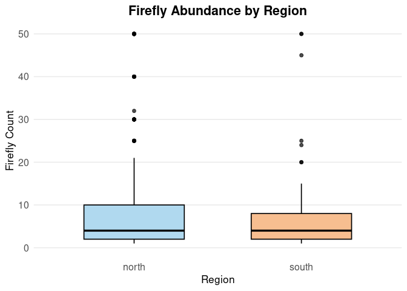

Warm-up mini-Report: Mosquito Blood Hosts in Salt Lake City, Utah
================
Caden Blaser
2025-10-29

- [ABSTRACT](#abstract)
- [BACKGROUND](#background)
- [STUDY QUESTION and HYPOTHESIS](#study-question-and-hypothesis)
  - [Questions](#questions)
  - [Hypothesis](#hypothesis)
  - [Prediction](#prediction)
- [METHODS](#methods)
- [1st analysis](#1st-analysis)
- [Plot 1](#plot-1)
- [2nd analysis](#2nd-analysis)
- [DISCUSSION](#discussion)
  - [Interpretation of 1st analysis](#interpretation-of-1st-analysis)
  - [Interpretation of 2nd analysis](#interpretation-of-2nd-analysis)
- [CONCLUSION](#conclusion)
- [REFERENCES](#references)

# ABSTRACT

Fill in abstract at the end after we have finished the methods, results,
discussion, conclusions and know what our data “says”.

# BACKGROUND

Fill in some text here that provides background info.

NOTE: Examples of data you can plot for the background info at
<https://github.com/saarman/BIOL3070/>

# STUDY QUESTION and HYPOTHESIS

## Questions

Does the location (Northern or Southern) of the fireflies affect the
level of abundance. 

## Hypothesis

The geographic location of fireflies (Northern vs. Southern populations)
will affect the abundance, with northern populations having a higher
abundance than southern populations due to the climate. 

## Prediction

# METHODS

We can use a t-test or an ANOVA. The t-test would allow us to test
between the two variables. 

# 1st analysis

# Plot 1

``` r
# Firefly Boxplot

# Load needed packages
library(ggplot2)
library(stringi)

# Read in the dad
fireflies <- read.csv("Copy of firefliesUtah - Usable Data.csv", stringsAsFactors = FALSE)

# Rename columns to simpler names
colnames(fireflies) <- c("firefly_count", "region")

# Diagnostics
cat("Original region values:\n")
```

    ## Original region values:

``` r
print(unique(fireflies$region))
```

    ## [1] "north" "south" ""

``` r
cat("\nCounts by region (before cleaning):\n")
```

    ## 
    ## Counts by region (before cleaning):

``` r
print(as.data.frame(table(region = fireflies$region, useNA = "ifany")))
```

    ##   region Freq
    ## 1           2
    ## 2  north  434
    ## 3  south   61

``` r
# Replace blanks with NA
fireflies$region[fireflies$region == ""] <- NA

# Normalize
fireflies$region <- stri_trans_general(fireflies$region, "NFKC")

# Remove invisible characters
fireflies$region <- stri_replace_all_regex(fireflies$region, "\\p{C}", "")

# Convert non-breaking spaces to regular and trim spaces
fireflies$region <- gsub("\u00A0", " ", fireflies$region)
fireflies$region <- trimws(fireflies$region)

# Convert to lowercase
fireflies$region <- tolower(fireflies$region)

# Fix obvious typos or abbreviations
fireflies$region[fireflies$region %in% c("n", "nrth", "noth")] <- "north"
fireflies$region[fireflies$region %in% c("s", "sth", "soth")] <- "south"

# Keep valid categories
fireflies$region <- factor(fireflies$region, levels = c("north", "south"))
fireflies_clean <- droplevels(subset(fireflies, !is.na(region)))

# Check column names
cat("\nUnique cleaned region values:\n")
```

    ## 
    ## Unique cleaned region values:

``` r
print(unique(fireflies_clean$region))
```

    ## [1] north south
    ## Levels: north south

``` r
cat("\nCounts by region (after cleaning):\n")
```

    ## 
    ## Counts by region (after cleaning):

``` r
print(as.data.frame(table(region = fireflies_clean$region)))
```

    ##   region Freq
    ## 1  north  434
    ## 2  south   61

``` r
#Box Plot
ggplot(fireflies_clean, aes(x = region, y = firefly_count, fill = region)) +
geom_boxplot(width = 0.6, color = "black", alpha = 0.7) + # clean, solid boxes
labs(
title = "Firefly Abundance by Region",
x = "Region",
y = "Firefly Count"
) +
scale_fill_manual(values = c("north" = "#8EC9E8", "south" = "#F4A261")) + # subtle professional palette
coord_cartesian(ylim = c(0, 50)) +
theme_minimal(base_size = 13) +
theme(
legend.position = "none",
plot.title = element_text(size = 16, face = "bold", hjust = 0.5),
axis.text = element_text(size = 12),
axis.title = element_text(size = 13),
panel.grid.major.x = element_blank(),
panel.grid.minor = element_blank()
)
```

    ## Warning: Removed 1 row containing non-finite outside the scale range
    ## (`stat_boxplot()`).

<!-- -->

# 2nd analysis

# DISCUSSION

## Interpretation of 1st analysis

## Interpretation of 2nd analysis

# CONCLUSION

# REFERENCES

1.  ChatGPT. OpenAI, version Jan 2025. Used as a reference for functions
    such as plot() and to correct syntax errors. Accessed 2025-10-29.
